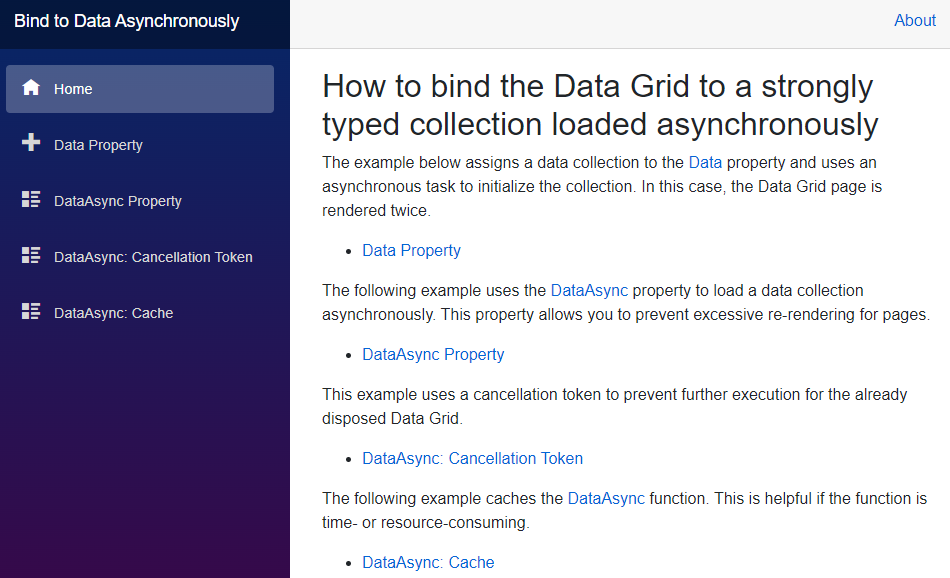

<!-- default badges list -->

<!-- default badges end -->
# How to bind the Data Grid to a strongly typed collection loaded asynchronously

You can bind the Data Grid component to a collection that is loaded synchronously or asynchronously.

In this example, there are four options that allow you to bind the DxDataGrid to an asynchronously loaded collection:
* [Data Property](./CS/DataBindingSamples/Pages/DataProperty.razor)  
Assigns a strongly typed collection to the [Data](https://docs.devexpress.com/Blazor/DevExpress.Blazor.DxDataGrid-1.Data) property and uses an asynchronous task to initialize the collection. The Data Grid page is rendered twice.
* [DataAsync Property](./CS/DataBindingSamples/Pages/DataAsyncProperty.razor)  
Uses the [DataAsync](https://docs.devexpress.com/Blazor/DevExpress.Blazor.DxDataGrid-1.DataAsync) property to load a strongly typed collection asynchronously and specifies a key data field to identify a data source instance.
* [DataAsync: Cancellation Token](./CS/DataBindingSamples/Pages/DataAsyncProperty.CancellationToken.razor)  
Uses the [DataAsync](https://docs.devexpress.com/Blazor/DevExpress.Blazor.DxDataGrid-1.DataAsync) property to load a data collection asynchronously and processes a cancellation token to prevent further execution for the disposed Data Grid.
* [DataAsync: Cache](./CS/DataBindingSamples/Pages/DataAsyncProperty.Cache.razor)  
Caches the [DataAsync](https://docs.devexpress.com/Blazor/DevExpress.Blazor.DxDataGrid-1.DataAsync) function. We recommend that you use this approach if the function is time- or resource-consuming.

<!-- default file list -->

## Files to Look At

* [Data Property](./CS/DataBindingSamples/Pages/DataProperty.razor)
* [DataAsync Property](./CS/DataBindingSamples/Pages/DataAsyncProperty.razor)
* [DataAsync: Cancellation Token](./CS/DataBindingSamples/Pages/DataAsyncProperty.CancellationToken.razor)
* [DataAsync: Cache](./CS/DataBindingSamples/Pages/DataAsyncProperty.Cache.razor)

<!-- default file list -->

## Documentation

* [Data Grid - Data](https://docs.devexpress.com/Blazor/DevExpress.Blazor.DxDataGrid-1.Data)
* [Data Grid - DataAsync](https://docs.devexpress.com/Blazor/DevExpress.Blazor.DxDataGrid-1.DataAsync)

## More Examples

* [Data Grid - Bind to Web API Service](https://github.com/DevExpress-Examples/blazor-DxDataGrid-Bind-To-Web-Api-Service)
